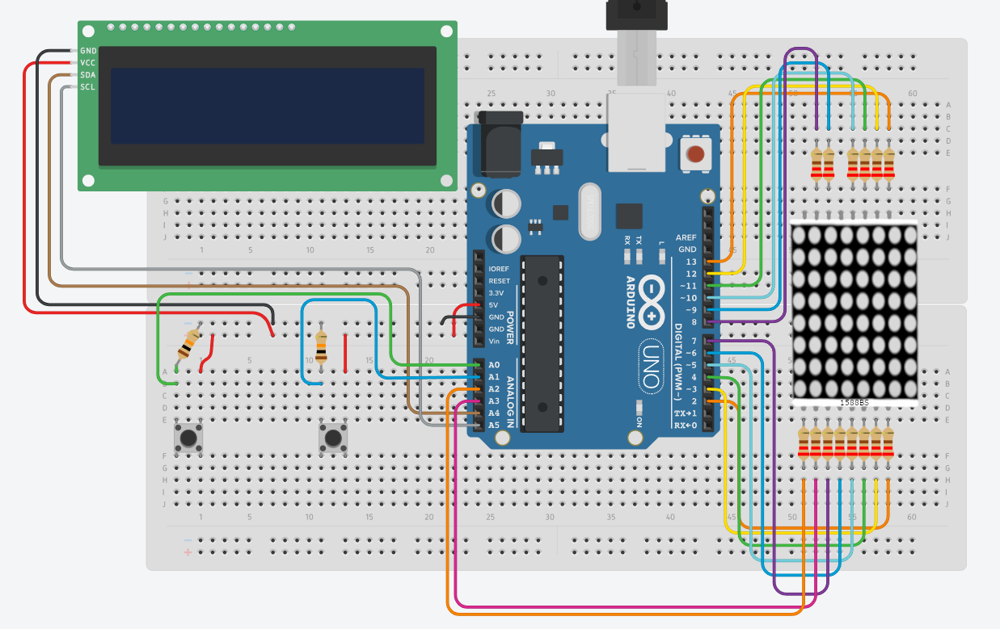

<h1 align="center">Jogo Timberman no Arduino</h1>

<h2 align="center">⏹️ <a href='#Sobre'>Sobre</a> ⏹️ <a href='#Motivo'>Motivação</a> ⏹️ <a href='#Experimente'>Experimente</a></h2>

 

<h2 id='Sobre' align="center">Simulando o jogo virtual Timberman na plataforma do Arduino</h2>

Esse projeto demonstra quão poderoso pode ser esse dispositivo com um pouco de programação 🧑‍💻 e elaboração de circuitos 

<h3>Tecnologias: 📑 Microcontroladores 📑 Montagem de circuitos eletrônicos 📑 C++ </h3>
 
<h3 id='Motivo'>Motivação:</h3>

 ▫️ Projeto realizado para apresentação na disciplina de Microprocessadores e Microcontroladores.
 

 ▫️ Proporcionando novos aprendizados em áreas de circuitos elétricos e plataformas de prototipagem como Arduino.
 

<h3 align="center" id='Experimente'>Monte o projeto você também!</h3>

<h4 id='Materiais'>Materiais necessários</h3>

 ▫️ 1x Placa Arduino Uno 
 

 ▫️ 1x Cabo USB A-B 
 

 ▫️ 1x Display LCD I2C 16x2 com módulo PCF8574 
 

 ▫️ 1x Matriz 8x8 LED 1588BS
 

 ▫️ 16x Resistores 220 ohms 
 

 ▫️ 2x Botões Push 
 

 ▫️ 2x Resistores 10k ohms 
 

 ▫️ 2x Protoboards com 830 furos 
 

 ▫️ Cabos jumpers macho-macho e macho-fêmea 
 
 

<strong>1º</strong> Faça download da <a href='https://www.arduino.cc/en/software' target='_blank'>Arduino IDE</a>, porque através dela é possível escrever, compilar e enviar o código para o <strong>microcontrolador</strong> do Arduino.

<strong>2º</strong> Monte o circuito de acordo com o esquema a seguir:

 

<strong>3º</strong> Faça o download do diretório <strong>code/code.ino</strong> é importante que o arquivo .ino esteja em um diretório com o mesmo nome para ser executado corretamente pelo Arduino IDE.

<strong>4º</strong> Agora, basta enviar o código para o Arduino através do botão <strong>upload</strong>, durante esse processo, o Arduino Uno deve estar conectado no computador via USB e tando o modelo do Arduino quanto a porta <strong>COM</strong>
 em que a conexão é feita devem ser informados. Geralmente a selecão do modelo e da porta COM é feita automaticamente pelo Arduino IDE, mas caso haja problemas basta buscar a solução na internet ou abrir uma issue aqui.

 
<strong>5º</strong> Finalizado! Comece a testar e jogar essa recriação do jogo casual Timberman feita utilizando um Arduino e alguns periféricos.

